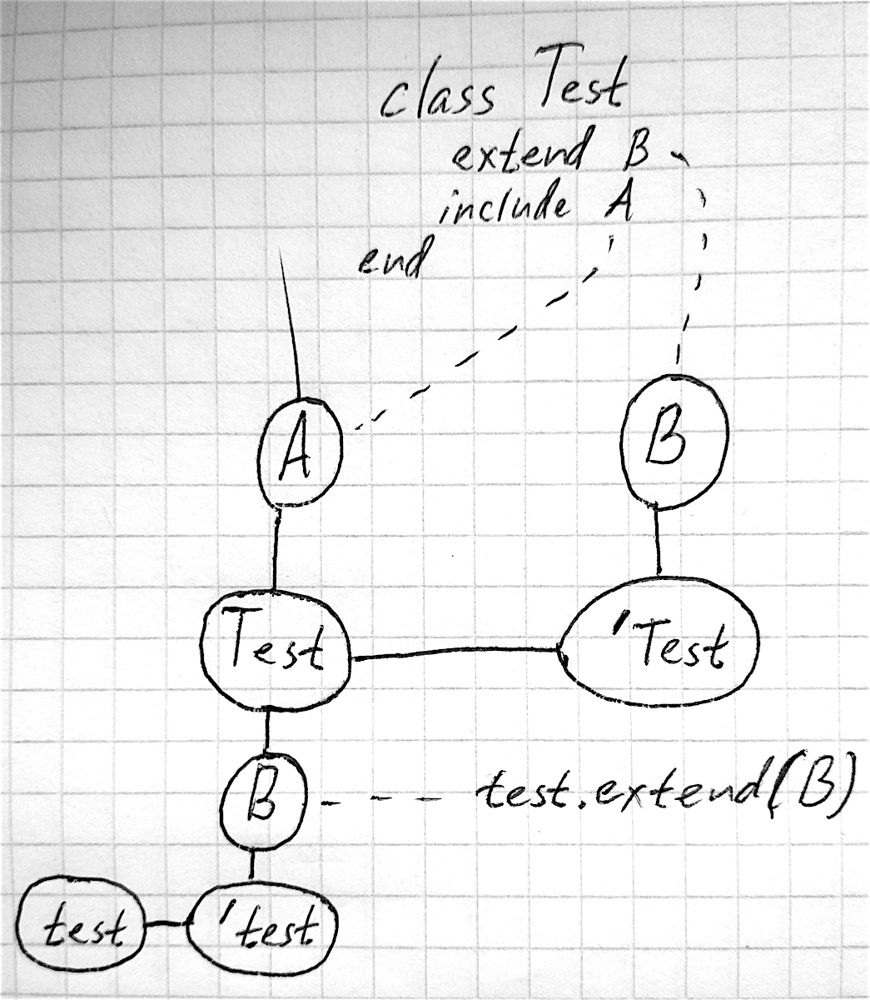

## Defining a simple class

```ruby
class Car
  # code...
end

AnotherCar = Class.new do
  # code...
end
```

## Creating objects

```ruby
car = Car.new

car.class # => Car

car.is_a? Car # => true

Car.ancestors
# => [Car, Object, Kernel, BasicObject]
```

## Defining methods

```ruby
class Car
  def accelerate!
    @moving = true
  end

  def stop!
    @moving = false
  end

  def moving?
    @moving
  end
end
```
---
```ruby
car = Car.new   # => #<Car:0x00000002033700>
car.moving?     # => nil
car.accelerate! # => true
car.moving?     # => true
car.stop!       # => false
car.moving?     # => false

car.inspect
# => "#<Car:0x00000002033700 @moving=false>"
```

## Initializers

```ruby
class Car
  def initialize(type)
   @type = type
  end

  def big?
    @type == 'big'
  end
end

car = Car.new('big')

car.big? # => true
```

## Attributes

```ruby
class Snake
  def length
    @meters * 100
  end

  def length=(santimeters)
    @meters = santimeters / 100.0
  end
end

snake = Snake.new
snake.length = 150 # => 150
snake.length       # => 150.0
snake.inspect
#=> "#<Snake:0x00000002777930 @meters=1.5>"
```

### attr_accessor
```ruby
class Snake
  def length
    @length
  end

  def length=(new_value)
    @length = new_value
  end
end

class Snake
  attr_accessor :length
end
```
### attr_reader
```ruby
class Snake
  def length
    @length
  end
end

class Snake
  attr_reader :length
end
```

### attr_writer
```ruby
class Snake
  def length=(new_value)
    @length = new_value
  end
end

class Snake
  attr_writer :length
end
```
---

```ruby
class Snake
  def length # attr_reader, attr_accessor
    @length
  end

  def length=(new_value) # attr_writer, attr_accessor
    @length = new_value
  end
end
```

## Defining operators
```ruby
class Snake
  attr_reader :length

  def initialize(length)
    @length = length
  end

  def +(other)
    Snake.new(length + other.length)
  end
end
```
---
```ruby
snake_1 = Snake.new(1) # => #<Snake:0x00000002f7d878 @length=1>
snake_2 = Snake.new(2) # => #<Snake:0x00000002f09fe0 @length=2>
snake_3 = snake_1 + snake_2
# => #<Snake:0x00000002eb3050 @length=3>
```

## Comparation
```ruby
class Snake
  attr_reader :length

  def initialize(length)
    @length = length
  end
end

snake = Snake.new(1) # => #<Snake:0x000000020800c8 @length=1>
other_snake = Snake.new(1) # => #<Snake:0x00000001e80ae8 @length=1>
snake == other_snake # => false
```
---
```ruby
class Snake
  attr_reader :length

  def initialize(length)
    @length = length
  end

  def ==(other)
    if other.is_a? Snake
      length == other.length
    else
      false
    end
  end
end

snake = Snake.new(1)
other_snake = Snake.new(1)
snake == other_snake # => true
```

## Self
```ruby
class Snake
  attr_reader :length

  def initialize
    @length = 1
  end

  def snake
    self
  end

  def length_redefign
    length # => 1
    length = 5
    length # => 5
    self.length # => 1
  end
end
```

## Class methods
```ruby
class Snake
  def self.description
    'SNAAAAKESSS'
  end
end

class Snake
  class << self
    def normal_description
      'Snakes are elongated, legless, carnivorous reptiles of the suborder Serpentes' \
      'that can be distinguished from legless lizards by their lack of eyelids and external ears.'
    end
  end
end

Snake.description # => 'SNAAAAKESSS'
Snake.normal_description # => 'Snakes ...'
```

## Class variables
```ruby
class Snake
  @@count = 0

  def initialize
    @@count += 1
  end

  def all_count
    @@count
  end
end
Snake.new.all_count # => 1
Snake.new.all_count # => 2
```

## Class instance variables
```ruby
class Snake
  @count = 0
  def self.add
    @count += 1
  end
  def initialize
    self.class.add
  end
  def all_count
    @count
  end
  def self.count
    @count
  end
end
snake = Snake.new
# Oops..
snake.all_count # => nil
Snake.count # => 1
```

## Class constants
```ruby
class Snake
  NORMAL_LENGTH = 2
end

Snake::NORMAL_LENGTH # => 2

Snake::NORMAL_COLOR = '#6B554A'
Snake::NORMAL_COLOR # => '#6B554A'

Snake::NORMAL_COLOR = '#2D2D2D' # => warning: already initialized constant Snake::NORMAL_COLOR
Snake::NORMAL_COLOR # => '#2D2D2D'
```

## Visibility private
```ruby
class Snake
  attr_reader :length

  private

  def initialize
    set_defaults
  end

  def set_defaults
    @length = 2
  end
end

snake = Snake.new
snake.length # => 2
snake.set_defaults
# NoMethodError: private method `set_defaults'
# called for #<Snake:0x00000001d29b90 @length=2>
```

## Visibility protected
```ruby
class Snake
  def +(other)
    Snake.new(length + other.length)
  end

  private

  def initialize(length)
    @length = length
  end

  protected

  attr_reader :length
end

snake1 = Snake.new(1)
snake2 = Snake.new(2)

snake1 + snake2 # => #<Snake:0x00000001e82d70 @length=3>

snake1.length
# NoMethodError: protected method `length'
# called for #<Snake:0x00000001f95028 @length=1>
```

## Inheritance

```ruby
class Snake
  attr_reader :length
  def initialize(length)
    @length = length
  end
end

class LazySnake < Snake
  def initialize(length)
    @sleeping = false
    super
  end

  def toggle_sleep
    @sleeping = !@sleeping
  end

  def sleeping?
    @sleeping
  end
end

lazy = LazySnake.new(2)
lazy.length # => 2
lazy.sleeping? # => false
lazy.toggle_sleep
lazy.sleeping? # => true
```

### super

```ruby
class LazySnake < Snake
  def initialize(length)
    super(length + 1)
  end
end

lazy = LazySnake.new(2)
lazy.length # => 3
```

### class variables

```ruby
class A
  @@value = 1
  def self.value
    @@value
  end
end
A.value # => 1

class B < A
  @@value = 2
end

class C < A
  @@value = 3
end

B.value # => 3
```

### constants

```ruby
class A
  NUM = 2
end

class B < A
end

A::NUM # => 2
B::NUM # => 2

B::NUM = 3

A::NUM # => 2
B::NUM # => 3
```

## Class methods definitions
```ruby
class Snake
  def Snake.count
  end
end

class Snake
  class << self
    def count
    end
  end
end

class << Snake
  def count
  end
end
```

## Custom behaviour of instance

```ruby
snake = Snake.new
def snake.name
  "John"
end
snake.name # => John

class << snake
  def name
    "David"
  end
end
snake.name # => David

another = Snake.new
another.name # => NoMethodError: undefined method 'name'
```

## Module

```ruby
module Speaking
  def hi
    puts 'HI!!!'
  end
end

class Snake
  include Speaking
end

snake = Snake.new
snake.hi
# 'HI!!!!'
```

---

```ruby
module M
  class C
    X = 'a constant'
  end
  C::X  # => "a constant"
end
M::C::X # => "a constant"

module M
  Y = 'another constant'
  class C
    ::M::Y # => "another constant"
  end
end

M.constants # => [:C, :Y]
```

## Constants lookup order

```ruby
module Kernel
  A = B = C = D = E = F = "from kernel"
end

A = B = C = D = E = "from toplevel"

class Super
  A = B = C = D = "from superclass"
end

module Included
  A = B = C = "from included module"
end

module Enclosing
  A = B = "from enclosing module"

  class Local < Super
    include Included

    A = "defined locally"

    puts A  # "defined locally"
    puts B  # "from enclosing module"
    puts C  # "from included module"
    puts D  # "from superclass"
    puts E  # "from toplevel"
    puts F  # "from kernel"
  end
end
```

## Include and extend

```ruby
module A
  def a
    puts 'a'
  end
end

module B
  def b
    puts 'b'
  end
end
```

---

```ruby
class Test
  include A
  extend B
end

test = Test.new
test.a # 'a'

test.b # NoMethodError
Test.b # 'b'

test.extend(B)
test.b # 'b'
```
---

---
